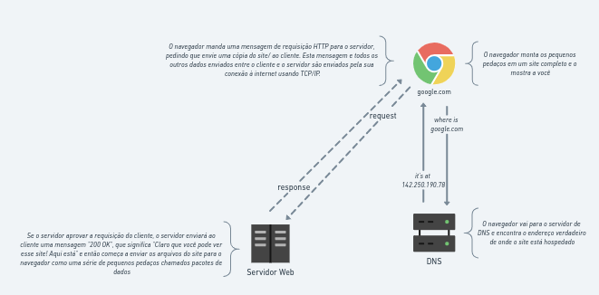

## Internet

A Internet é a espinha dorsal da Web, a infraestrutura técnica que faz a Web possível. Mas basicamente, a Internet é uma gigantesca rede de computadores que se comunicam juntos.

Ela começou nos anos 60 como um projeto de pesquisa consolidado pelo exército norte americano, e tornou-se uma infraestrutura pública nos anos 80 com o suporte dado por diversas universidades públicas e companhias privadas. As várias tecnologias que suportam a internet evoluíram através do tempo, mas a forma de funcionamento não mudou muito: Internet é uma forma de conectar computadores e garantir, em qualquer situação, que eles encontrem uma forma de se manter conectados.

### Rede simples

Quando dois computadores precisam se comunicar, você precisa conectá-los, seja fisicamente (normalmente com um Cabo de rede) ou de uma forma sem fio.

Com o crescimento da quantidade de computadores interligados surge a necessidade de equipamentos que realizam controles de tráfego e gerenciamento dessas redes, o roteador tem o papel de facilitar e gerenciar a comunicação de computadores, sendo ele o ponto central que interligam vários computadores ao mesmo tempo.

### Uma rede de redes

A internet sendo uma rede mundial é interligada por milhões, bilhões de computadores e diversas redes interligadas, sendo assim essa é gerenciada por diversos dispositivos de rede, como o modem que recebe o sinal da ISP ( provedor de internet ) realiza temos em casa que tem o papel de modular/desmodular o sinal para que possa ser utilizada por equipamento eletrônicos e seja também transportado de volta ao provedor, que por sua vez possui acesso a outras redes e ISP.

### Encontrando computadores

Computadores possuem endereço na rede para que seja indetificados e esse endereço é conhecido como endereço IP (Internet Protocol), como por exemplo: 192.168.10.101.

Para facilitar esses IP's não são acessados diretamente por nois no navegador para acessar um site por exemplo, ao invés disso é criado os _nome de domínios_ que é um 'apelido' a um endereço de IP que identifica um página web, ex.: google.com que acessa o IP 142.250.190.78.

### A internet e a Web

Internet é uma infraestrutura técnica que permite conectar bilhões de computadores. Entre estes computadores, alguns computadores (chamados de servidores Web) podem enviar mensagens inteligíveis para navegadores Web. A Internet é a infraestrutura, enquanto a Web é um serviço construído sob esta infraestrutura. Vale a pena notar que existem diversos outros serviços que funcionam na Internet, tais como email e IRC.

### Intranets e Extranets

Intranets são privadas restrita a uma organização, geralmente utilizadas apara prover recursos compartilhados entro os membros da rede.

A intranet de uma organização pode hospedar páginas da web para compartilhar informações de departamentos ou equipes, unidades compartilhadas para gerenciamento de documentos e arquivos importantes, portais para executar tarefas de administração de negócios e ferramentas de colaboração como wikis, quadros de discussão e sistemas de mensagens.

Extranets são bastante semelhantes às Intranets, exceto pelo fato de que abrem toda ou parte de uma rede privada para permitir o compartilhamento e a colaboração com outras organizações.

Elas são normalmente usadas para compartilhar informações de forma segura com clientes e partes interessadas que trabalham em estreita colaboração com uma empresa. Frequentemente, suas funções são semelhantes às fornecidas por uma intranet: informações e compartilhamento de arquivos, ferramentas de colaboração, fóruns de discussão, etc.

Tanto as intranets quanto as extranets são executadas no mesmo tipo de infraestrutura que a Internet e usam os mesmos protocolos. Eles podem, portanto, ser acessados por membros autorizados de diferentes locais físicos.

## Como a Web funciona?

### Clientes e Servidores

Computadores conectados à web são chamados **clientes** e **servidores**.

- **Clientes** são os típicos dispositivos conectados à internet dos usuários da web (por exemplo, seu computador conectado ao seu Wi-Fi ou seu telefone conectado à sua rede móvel) e programas de acesso à Web disponíveis nesses dispositivos (geralmente um navegador como Firefox ou Chrome).

- **Servidores** são computadores que armazenam páginas, sites ou aplicativos. Quando o dispositivo de um cliente quer acessar uma página, uma cópia dela é baixada do servidor para a máquina do cliente para ser apresentada no navegador web do usuário.

### Outras tecnologias envolvidas

Além do cliente e do servidor, existem alguns conceitos importantes no caminho.

- **Sua conexão de Internet**: permite que você mande e receba dados na web.
- **TCP/IP**: Protocolo de Controle de Transmissão e Protocolo de Internet (Transmission Control Protocol e Internet Protocol) são protocolos de comunicação que definem como os dados trafegam pela web.
- **DNS**: Servidor de Nome de Domínio (Domain Name Servers) são como um catálogo de endereços para sites. Quando você digita um endereço web no seu navegador, o navegador procura no servidor de DNS para localizar o endereço real do site, antes que ele possa recuperar o site. O navegador precisa encontrar em qual servidor web a página está hospedada para que ele possa mandar mensagens HTTP ao lugar certo.
- **HTTP**: Protocolo de Transferência de Hypertexto (Hypertext Transfer Protocol) é um protocolo de aplicação que define uma linguagem para clientes e servidores se comunicarem entre si.

- **Files**: um website é feito de muitos arquivos diferentes, que são como as diferentes. Esses arquivos são divididos em dois tipos principais:

> **Arquivos de Código**: os sites são feitos principalmente de HTML, CSS e JavaScript, embora você possa conhecer outras tecnologias mais tarde.
> **Recursos**: esse é o nome coletivo para todas as outras coisas que compõem um site, como imagens, música, vídeos, documentos do Word e PDFs.

##### Fluxo cliente - servidor

### DNS

Endereços web verdadeiros não são sequências de textos boas e fáceis de lembrar que você digita na sua barra de endereços para encontrar seus sites favoritos. Eles são números especiais que se parecem com isso: 63.245.215.20.

O servidor DNS possuem tabelas que relaciona o domínio ( nome dado ao site ) ao Ip real de onde esta armazenado, sites podem ser acessado pelo seu número de Ip, porém como é algo difícil de ser lembrado o DNS resolve esse problema.

### Pacotes

Basicamente, quando os dados são enviados pela web, eles são enviados como milhares de pequenos blocos, para que muitos usuários diferentes possam baixar o mesmo site ao mesmo tempo. Se os websites fossem enviados como um grande bloco, somente um usuário por vez poderia baixá-los, o que, obviamente, tornaria a web muito ineficiente e não muito divertida de usar.
sa encontrar em qual servidor web a página está hospedada para que ele possa mandar mensagens HTTP ao lugar certo.

- **HTTP**: Protocolo de Transferência de Hypertexto (Hypertext Transfer Protocol) é um protocolo de aplicação que define uma linguagem para clientes e servidores se comunicarem entre si.

- **Files**: um website é feito de muitos arquivos diferentes, que são como as diferentes. Esses arquivos são divididos em dois tipos principais:

> **Arquivos de Código**: os sites são feitos principalmente de HTML, CSS e JavaScript, embora você possa conhecer outras tecnologias mais tarde.

> **Recursos**: esse é o nome coletivo para todas as outras coisas que compõem um site, como imagens, música, vídeos, documentos do Word e PDFs.
