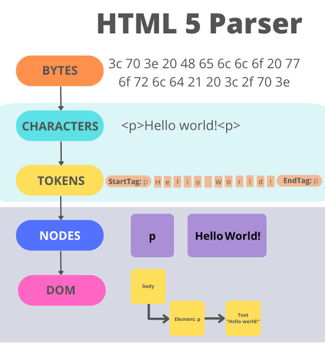
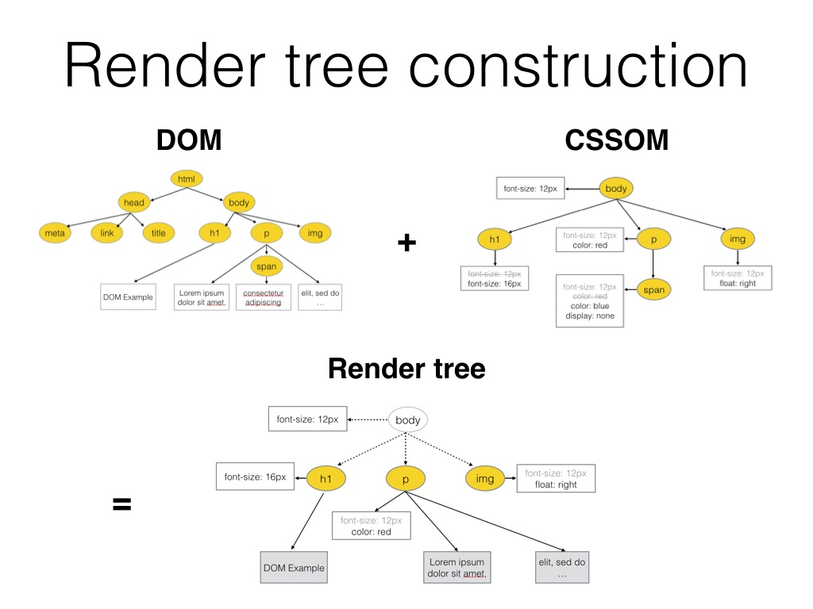

## Como os Navegadores Funcionam

Navegadores são _softwares client_ ( **chrome**, **firefox**, **edge**, **safari** ) que estamos acostumados a utilizar para acessar as páginas web, com a evolução da internet e das tecnologias atuais podemos executar **webApps** complexas através deles, alguns exemplos são **youtube**, **spotify**, **facebook**, **instagram** e muitos outros, porém toda página/sistemas precisam percorrer um caminho até que seja pintado o primeiro pixel na tela.

> Mas o que acontece por trás dos panos para uma pagina ser exibida em tela?

Até chegar a renderizar uma pagina web na tela do seu computador o navegadores lidam com vários passos importantes, esses são fundamentais que um desenvolvedor web tenha conhecimento para tornar suas apps melhores e mais performáticas.

> Vamos conhecer um pouco de como esses softwares funcionam ?

### Componentes principais

Os navegadores possuem alguns componentes que são os principais responsáveis pela caminho realizado até a renderização da informação na tela.

- A **User Interface** ou **interface de usuário**, que é a interface do navegador que estamos acostumados que temos acesso para configurações e acesso a uma página web.

- **Browser Engine** realiza a intermediação entre a **UI** e a **Engine de renderização**, responsável pela **persistência de dados** no navegador ( cookies, localStorage, indexedDB) e Web API's ( Canvas, WebSockets, webGL ... ).
- **Rendering Engine** que é o motor que lida com o fluxo de renderização do navegador e cada um possuem uma engine diferente tais como: **Chrome - Blink** | **FireFox - Genko** | **Safire - Webkit**.

### Navegação - O fluxo principal

Vamos entender o que ocorre quando acessamos uma página na web, seguindo todo o fluxo padrão e o que o navegador faz para que seja possível exibir a página na tela.

- 1 - Inserimos o endereço web no campo de busca do navegador ( www.google.com.br ) após pressionarmos o **enter** o componente responsável por lidar com **networking** realiza os passos:

- 2 - Parsear a [URL](https://developer.mozilla.org/en-US/docs/Glossary/url) ( protocolo / domínio / recurso ).
- 3 - Realizar a request [DNS](https://developer.mozilla.org/en-US/docs/Glossary/DNS) que transforma o endereço web em um [IP](https://developer.mozilla.org/en-US/docs/Glossary/IP_Address) ( www.google.com.br -> 142.251.129.227).
- 4 - Abre uma conexão [TCP](https://developer.mozilla.org/en-US/docs/Glossary/tcp) com o servidor e envia uma requisição [HTTP](https://developer.mozilla.org/en-US/docs/Glossary/http).

Um vez que existe essa comunicação com o servidor esse responde - **response** - com o que foi solicitado, pode ser a página **index.html** por exemplo, essa realizar outras requisições - **requests** - de acordo com o que for necessário para exibir a página corretamente ( _css_, _images_, _fonts_, _scripts_ ).

### Fluxo de renderização

O navegador após receber os dados solicitados realiza alguns passos internos para que a renderização seja possível.

#### Parser

O navegador via protocolo **http** recebe as informações como [strings](https://developer.mozilla.org/en-US/docs/Glossary/string) após serem tratadas por algum tipo de codificação binária geralmente [UTF-8](https://developer.mozilla.org/en-US/docs/Glossary/utf-8).

Essa **string** é tratada por um [ **Parser** ](https://developer.mozilla.org/en-US/docs/Glossary/parser) - _( Parsear significa traduzir uma estrutura para algo que o código possa usar )_ - que transforma a string (html) em uma árvore de nós que representa a estrutura do documento ( **DOM** -Document Object Model ).

#### Grammars

**Grammars** são as **regras de syntax** que o documento deve seguir de acordo com uma linguagem. Toda linguagem tem uma gramática determinística ( _vocabulário_ ), isso se chama [context free grammar](https://pt.wikipedia.org/wiki/Context-free_grammar).

Após a engine parsear o HTML para nós da DOM esses se tornam uma árvore chamada **content tree**.

#### Analise Léxica e Sintática

[Analise Léxica](https://johnidm.gitbooks.io/compiladores-para-humanos/content/part1/lexical-analysis.html) - com as regras da gramática quebra o código em [tokens](<https://pt.wikipedia.org/wiki/Token_(inform%C3%A1tica)>) internamente que definem suas propriedades e regras - **HTML** - ( _inicio e fim da Tag_, _nomes e valores de atributos_ ).

[Analise Sintática](https://johnidm.gitbooks.io/compiladores-para-humanos/content/part1/syntax-analysis.html) - é responsável por analisar uma árvore de nós e verificar se a estrutura do documento está de acordo com as regras sintáticas.

> Esses **tokens** são enviados para o construtor da árvore que os reconhece e monta a **DOM**.

O resultado final de todo esse processo é o **Object Document Model**, ou **DOM**, que é usada pelo navegador para todos os demais processamentos da página.

> **Flow** - _bytes_ -> _chracteres_ -> _tokenização_ -> _construção da árvore_ -> _DOM_

Enquanto a DOM estava sendo renderizada o **CSS** associado a página assim como o HTML também passa pelo processo semelhante desta vez criando o **CSS Object Model** ou [CSSOM](https://developer.mozilla.org/en-US/docs/Glossary/CSSOM).

- As regras de objetos CSS contêm seletores e a declaração dos objetos correspondentes a gramática CSS.

> **Flow** - _bytes_ -> _chracteres_ -> _tokenização_ -> _construção da árvore_ -> _CSSOM_

No momento de calcular os estilos da página o navegador começa com a regra mais aplicáveis ( _body_ ) e logo em seguida vai refinando para as regras mais específicas.

Com a **DOM** e a **CSSOM** criadas o navegador consegue criar a árvore de renderização ( **render tree** ).

O navegador pinta cada nó na página, todo esse processo toma tempo e pode impactar na **performance** da página web.

> O **JS** é também é importante nesse fluxo pois ele é bloqueante e precisa ser executado para definir a rende tree.

#### Layout / Reflow

Layout é o processo recursivo que começa da raiz da árvore **\<html\>** e continua recursivamente por toda a hierarquia do HTML computando informações geométricas que define as exatas coordenadas de onde cada nó deve aparecer na tela.

<!--  -->

#### Painting

A camada **UI Backend** tem o papel de atravessar cada elemento da render tree desenhando usando toda UI da página.

#### Engine Javascript

A engine JS é o motor que interpreta a linguagem, alguns exemplos são o **spider monkey** do firefox e o mais famoso **V8** do chrome que também é usado pelo **NodeJS**.

O Javascript pode criar e modificar todo o **DOM** ou o **CSSOM**. Quando o analisador do HTML encontra uma tag **script** ela para toda a construção da DOM e só retoma quando conclui a execução do script.

> Existe formas de otimizar esse processo através de atributos da tag \<script\>.

Para melhorar a experiência do usuário o engine de renderização vai tentar mostrar o conteúdo na tela assim que possível, então não espera que outro HTML seja parseado até começar a construir página.

### Critical Render Path e a Performance

O **critical render path** é a serie de eventos envolvendo baixar os recursos ( **html**, **css**, **script**... ), processar( _conforme visto anteriormente_ ) e renderizar o primeiro pixel na tela. Se a página html contêm algum script altamente bloqueante o render start, o tempo levado para receber o primeiro byte de dados para o URL primário vai ser atrasado.

A velocidade que a página carrega impacta de forma significativa na experiência do usuário, onde segundos podem significar bilhões em case como da **Amazon**.

> O **devtool** dos navegadores fornecem forma de visualizar e analisar causa de impactos na performance no carregamento da página.

#### Otimização

Para que uma página tenha uma boa performance devemos entender as prioridades que a página necessita e o que não é relevante em um primeiro momento.

- Otimizar ordem de cada recurso crítico baixado.
- Lazy loading de recursos não críticos.
- Minificação de arquivos ( html, css e js ).
- Otimização de tamanhos de imagens/svg.

A tag **script** possuem os atributos **async** e **defer**, onde o _async_ indica que é um asset **não bloqueante** então deve ser executado de forma assíncrona e o _defer_ indica que o o script só deve ser executado depois que toda a DOM ser parseada.

Tanto o **HTML** quanto o **CSS** são recursos bloqueantes, ou seja, não existe renderização sem que ambos tenham árvore de renderização.

O CSS possuem atributos da tag **link** tais como **media** que permite definir css não bloqueante dependendo da finalidade do css especificado, a tag **link** também possuem atributo **rel** que possuem valores **_preload_** e **_prefetch_** que indica se o recurso é ou não importante ser baixado com prioridade.

> Os processos de _otimização_ não serão abordado de forma detalhada aqui, irei deixar links para artigos que darão mais detalhes de como realizar uma boa experiência para o usuário.

Existem ferramentas que lidam com unificação de arquivos, redução de tamanho de pacotes gerando arquivos otimizados, code split como é o caso dos **bundler** como o **webpack**.

Então é isso, aqui temos um overview de como é o caminho que o navegador percorre até que seja possível visualizarmos uma página em nossa tela e entender a importância de melhorar a performance desse processo.

- links de **referências** e **saiba mais**.
- - [Otimização Page Speed com Priority Hints](https://www.linkedin.com/pulse/otimizando-page-speed-com-priority-hints-dos-santos-silva-/?trk=pulse-article_more-articles_related-content-card&originalSubdomain=pt)
- - [Navegadores por de baixo dos panos - Ana Luiza Bastos](https://pt.slideshare.net/imasters/navegadores-por-de-baixo-dos-panos-ana-luiza-bastos)
- - [Critical rendering path](https://developer.mozilla.org/en-US/docs/Web/Performance/Critical_rendering_path#:~:text=The%20Critical%20Rendering%20Path%20is,render%20path%20improves%20render%20performance.)
- - [Como funcionam os navegadores Web? #HipstersPontoTube](https://youtu.be/kDy62zaCHZE)

>  _Este post tem como objetivo ajudar quem esta começando no aprendizado das tecnologias web, além de servir como incentivo no meus estudos e a criar outros posts pra fixação do aprendizado._ 

 Me pague um café :)_ | pix: <strong>nascimento.dev.io@gmail.com</strong> 

<h4> <em> Me Sigam :) </em> </h4>

[Linkedin](https://www.linkedin.com/in/nascimento-dev-io/) |
[Github](https://github.com/nascimento-dev-io)
