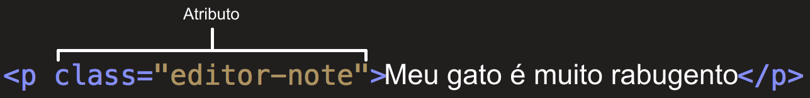

## HTML

HTML (Linguagem de Marcação de Hipertexto) é o código que você usa para estruturar uma página web e seu conteúdo. Por exemplo, o conteúdo pode ser estruturado em parágrafos, em uma lista com marcadores ou usando imagens e tabelas.

HTML consiste de uma série de elementos, que você usa para delimitar ou agrupar diferentes partes do conteúdo para que ele apareça ou atue de determinada maneira que também relação com a semântica do conteúdo.

### Anatomia de um elemento HTML

Vamos explorar esse parágrafo ( tag \<p\> ) mais profundamente.


As principais partes de um elemento são:

1. A **tag de abertura**: Consiste no nome do elemento (no caso, p), envolvido em **parênteses angulares** de abertura e fechamento. Isso demonstra onde o elemento começa, ou onde seu efeito se inicia — nesse caso, onde é o começo do parágrafo.
2. A **tag de fechamento**: Isso é a mesma coisa que a tag de abertura, exceto que inclui uma barra antes do nome do elemento. Isso demonstra onde o elemento acaba — nesse caso, onde é o fim do parágrafo.
3. O **conteúdo**: Esse é o conteúdo do elemento, que nesse caso é apenas texto.
4. O **elemento**: A tag de abertura, a de fechamento, e o conteúdo formam o elemento.

Elementos também podem ter atributos, que parecem assim:



Atributos contém informação extra sobre o elemento que você não quer que apareça no conteúdo real. Aqui, `class` é o nome do atributo e `editor-note` é o valor do atributo. O atributo class permite que você forneça ao elemento um identificador que possa ser usado posteriormente para aplicar ao elemento informações de estilo e outras coisas.

Um atributo sempre deve ter:

1. Um espaço entre ele e o nome do elemento (ou o atributo anterior, se o elemento já tiver um).
2. O nome do atributo, seguido por um sinal de igual.
3. Aspas de abertura e fechamento, envolvendo todo o valor do atributo.

### Aninhando elementos

Você pode colocar elementos dentro de outros elementos também — isso é chamado de aninhamento. Se quiséssemos afirmar que nosso gato é muito mal-humorado, poderíamos envolver a palavra "muito" em um elemento \<strong\>, o que significa que a palavra deve ser fortemente enfatizada:

```html
<p>Meu gatinho é <strong>muito</strong> mal humorado.</p>
```

Você precisa, no entanto, certificar-se de que seus elementos estejam adequadamente aninhados. No exemplo acima, abrimos primeiro o elemento \< p \>, depois o elemento \<strong\>; portanto, temos que fechar primeiro o elemento \<strong\>, depois o elemento \<p\>.

Alguns elementos não possuem conteúdo e são chamados de **elementos vazios**. Considere o elemento \ que temos na nossa página HTML:

```html

```

Ele contém dois atributos, mas não há tag \</img\> de fechamento, e não há conteúdo interno. Isso acontece porque um elemento de imagem não envolve conteúdo para ter efeito em si mesmo. Sua proposta é incorporar uma imagem na página HTML no lugar que o código aparece.

### Anatomia de um documento HTML

Isso resume o básico dos elementos HTML individuais, mas eles não são úteis por si só. Agora vamos ver como elementos individuais são combinados para formar uma página HTML inteira.

```html
<!DOCTYPE html>
<html>
  <head>
    <meta charset="utf-8" />
    <meta name="viewport" content="width=device-width" />
    <title>Minha página de teste</title>
  </head>
  <body>
    
  </body>
</html>
```

Aqui nós temos:

- `<!DOCTYPE html>` — o **doctype**. É a parte inicial obrigatória do documento. Define o tipo do documento e atualmente, eles não fazem muito sentido e são basicamente necessários apenas para garantir que o documento se comporte corretamente.
- `<html></html>` — o elemento `<html>`. Esse elemento envolve todo o conteúdo da página e às vezes é conhecido como o **elemento raiz**.
- `<head></head>` — o elemento `<head>`. Esse elemento age como um recipiente de tudo o que você deseja incluir em uma página HTML que não é o conteúdo que você quer mostrar para quem vê sua página. Isso inclui coisas como palavras-chave e uma descrição que você quer que apareça nos resultados de busca, CSS para dar estilo ao conteúdo, declarações de conjuntos de caracteres e etc.

- `<meta charset="utf-8">` — esse elemento define o conjunto de caracteres que seu documento deve usar para o **UTF-8**, que inclui praticamente todos os caracteres da grande maioria dos idiomas escritos. Essencialmente, agora ele pode manipular qualquer conteúdo textual que você possa colocar.

- `<title></title>` — o elemento `<title>`. Ele define o título da sua página, que é o título que aparece na guia do navegador onde sua página é carregada. Ele também é usado para descrever a página quando você a adiciona aos favoritos.

- `<body></body>` — o elemento `<body>`. Contém todo o conteúdo que você quer mostrar ao público que visita sua página, seja texto, imagens, vídeos, jogos, faixas de áudio reproduzíveis ou qualquer outra coisa.

Existem uma grande variedade de elementos de marcação HTML que possuem finalidades distintas ( listas, formulários, tabelas, imagens, audio, video ), é importante que a página seja bem estruturada para que seja possível a definição de um bom CSS em sua estilização assim como manipulação via JS.

- Para aprender sobre cada uma acesse a documentação **MDN** [HTML - Linguagem de Marcação de Hipertexto](https://developer.mozilla.org/pt-BR/docs/Web/HTML) e [Referência HTML](https://developer.mozilla.org/pt-BR/docs/Web/HTML/Reference).

- Boas práticas na criação do documentos HTML [boas práticas](https://github.com/hail2u/html-best-practices/blob/main/README.pt-BR.md)
