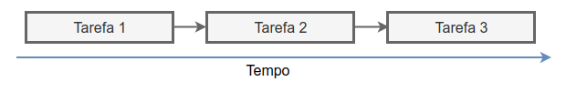
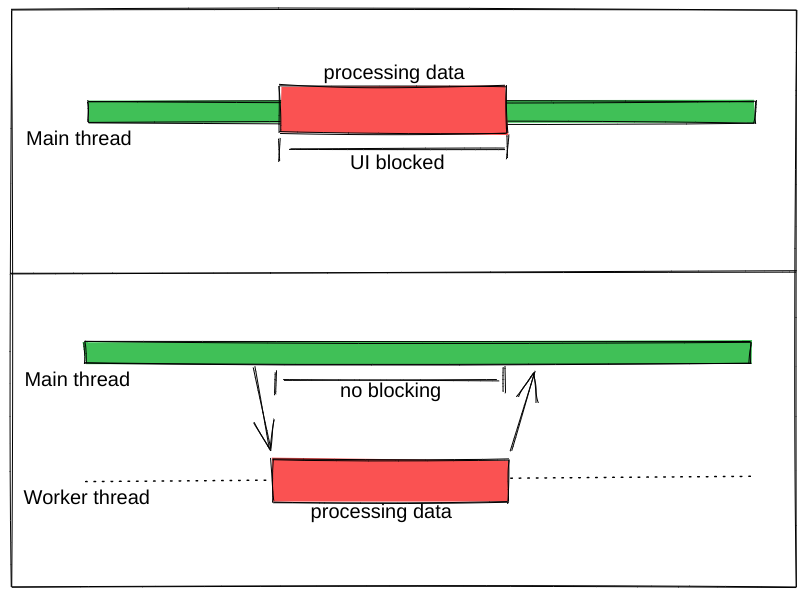

## Assíncronismo

> https://dev.to/nascimento_/javascript-assincronismo-53kj

Normalmente, o código de um programa é executado de forma direta, com **_uma coisa acontecendo por vez_**. Se uma função depende do resultado de outra função, ela tem que esperar o retorno do resultado, e até que isso aconteça, o programa inteiro praticamente para de funcionar do ponto de vista do usuário.

Dependendo do ambiente de programação que você está usando (navegadores da Web, no caso de desenvolvimento da Web) esses fornecem **API's** ( _fetch_, _promise_, _works_) que permitem executar essas tarefas de forma **assíncrona**, ou seja, realizar processamento **fora da thread principal** e após finalizar o resultado é retornado.

Técnicas **async** ( assíncronas ) são muito úteis, principalmente na programação web. Quando um aplicativo web é executado em um navegador e executa um pedaço de código rigoroso sem retornar o controle para o navegador, ele pode parecer que travou. Isso é chamado de **blocking**; o navegador está bloqueado de continuar a manusear a entrada do usuário e de realizar outras tarefas até que o aplicativo web retorne o controle do processador.

> _Tarefas pesadas como cálculos demorados, ou buscar uma informação em servidor podem demorar e bloqueiam o navegador e isso torna uma experiência ruim para o usuário._

### Threads

Uma **thread** é basicamente um único processo que um programa pode usar para concluir tarefas. Cada thread só pode fazer uma tarefa de cada vez:



Cada tarefa será executada sequencialmente, uma tarefa tem que ser concluída antes que a próxima possa ser iniciada.

> **JavaScript** é tradicionalmente **single-threaded**. Mesmo com múltiplos núcleos de processamento, você só pode fazê-lo executar tarefas em uma única thread, chamada de **main** **thread** (thread principal).

Depois de um tempo, o JavaScript ganhou algumas ferramentas para ajudar em tais problemas. As [Web workers](https://developer.mozilla.org/pt-BR/docs/Web/API/Web_Workers_API) te permitem mandar parte do processamento do JavaScript para uma **thread separada**.

> _Você geralmente usaria uma worker para executar um processo pesado para que a UI não seja bloqueada_.



> **Main thread**: Tarefa A --> Tarefa C

> > **Worker thread**: Tarefa pesada B

### Código Assíncrono

Os **Works** ajudam no processamento paralelo, porém eles possuem limitações e não são a principal solução em **JavaScript** para lidar com assíncronismo. Os browsers nos permitem executar certas operações de modo assíncrono através de recursos como **Promises** que te permitem executar uma operação e depois esperar pelo resultado antes de executar outra operação:

```
Main thread: Tarefa A                   Tarefa B
Promise:         | ---> operação async ---> |
```

Já que a operação está acontecendo em outro lugar, a **main thread** não está bloqueada enquanto a operação assíncrona está sendo processada.

### JavaScript Async

A programação assíncrona é uma técnica que permite que seu programa inicie uma tarefa potencialmente de longa duração e ainda seja capaz de responder a outros eventos enquanto essa tarefa é executada, em vez de ter que esperar até que essa tarefa seja concluída.

Muitas funções fornecidas pelos navegadores, podem levar muito tempo e, portanto, são assíncronas. Por exemplo:

- Fazendo solicitações HTTP usando **fetch()**
- Acessar a camera ou o microfone de um usuário usando **getUserMedia()**
- Pedindo a um usuário para selecionar arquivos usando **showOpenFilePicker()**

Na programação síncrona o programa executa o código uma linha de cada vez na ordem em que o escrevemos, aguardando a finalização da tarefa anterior para seguir para a próxima.

O problema dessa abordagem é que, quando o navegador precisa lidar com processamento que são potencialmente demorados a página **trava** até que o processamento retorne com o resultado.

O conceito de assíncronismo é usada para resolver esse tipo de problema, pois podemos delegar um processamento para uma função e continuar o fluxo de execução, após o processamento for concluído o seu retorno fica disponível para utilização.

- **Manipuladores de eventos** são exemplos de uso de assíncronismo, pois recebem funções ( _callbacks_ ) que são executadas baseada em disparo de evento.

#### Funções de Callback

**Callbacks** são funções passado como argumentos de outras funções, que é _chamada de volta_ quando um determinado evento/processo seja acionado, como por exemplo um evento do navegador como _click_ .

Essa era forma mais utilizada para lidar com comportamento _assíncrono_ no passado e que ainda é utilizado por algumas API's _event-driven_. Dependendo da operação a utilização de callback pode deixa o código com difícil legibilidade e dificulta manutenção conforme o exemplo abaixo:

```js
function doStep1(init, callback) {
  const result = init + 1;
  callback(result);
}

function doStep2(init, callback) {
  const result = init + 2;
  callback(result);
}

function doStep3(init, callback) {
  const result = init + 3;
  callback(result);
}

function doOperation() {
  doStep1(0, result1 => {
    doStep2(result1, result2 => {
      doStep3(result2, result3 => {
        console.log(`result: ${result3}`);
      });
    });
  });
}

console.log(doOperation()); // => result: 6
```

Como temos que chamar callbacks dentro de callbacks, obtemos uma função **doOperation()** profundamente aninhada ( às vezes é chamado de **callback hell** ), que é muito mais difícil de ler e depurar, como forma de lidar com esse problema foram criado novas formas de lidar com assíncronismo como **Promise.**

### Promises

Uma **Promise** é um **objeto** que representa a eventual conclusão ou falha de uma operação assíncrona e é a forma mais moderna de lidar com processamento assíncrono em javascript.

Para utilizar uma **Promise** é necessário instanciar la com o operador **new** passando uma função que recebe 2 argumentos ( **resolve**, **reject** ) esses são funções que são chamadas em caso de sucesso ou falha da operação.

Uma Promise sempre _retorna outra promise_ e utilizamos os métodos **.then** e **.catch** que retorna resultado seja de **sucesso** ou **falha** como parâmetro em sua função de callback.

_Vamos refatorar o exemplo anterior para melhor entendimento:_

```js
function doStep1(init) {
  return new Promise((resolve, reject) => {
    const result = init + 1;

    resolve(result);

    // tratar possíveis erros - reject(erro)
  });
}

function doStep2(init) {
  return new Promise((resolve, reject) => {
    const result = init + 2;

    resolve(result);

    // tratar possíveis erros - reject(erro)
  });
}

function doStep3(init) {
  return new Promise((resolve, reject) => {
    const result = init + 3;

    resolve(result);

    // tratar possíveis erros - reject(erro)
  });
}

function doOperation() {
  return doStep1(0)
    .then(result1 => doStep2(result1))
    .then(result2 => doStep3(result2))
    .then(result3 => console.log(`result: ${result3}`))
    .catch(err => console.log(err));
}

doOperation(); // => result: 6
```

Percebemos que removemos a função de callback e capturamos o valor do processamento através do método **.then**, esse pode ser encadeado com outras chamadas conforme o exemplo ( _evitando o callback hell_ ).

Utilizamos o **.catch** ao final para capturar possíveis erros no processamento. ( Nesse exemplo não foi simulado processamento assíncrono e retorno de erro por se tratar de um exemplo simplificado ).

> **Promises** deixam o código mais legível, fácil de entender e manter em casos mais complexos.

> A API de Promise possui métodos que ajudam em execução de operação de forma paralela como o **Promise.all()**, **Promise.race()** entre outros, para maior conhecimento deixarei o link do documentação ao final do post.

### Async / Await

Async / Await é um _sintax sugar_ ( forma simplificada ) para utilizar **promises**, com essa sintaxe o código fica similar a um código síncrono e não é necessário realizar encadeamento de métodos.

Normalmente utilizamos **await** dentro de uma função com o prefixo **async**, o await aguarda a resolução de uma Promise que geralmente é armazenada em uma variável e utilizada conforme desejado na sequencia do código.

> Utilizamos o bloco **try catch** para captura possíveis erros nos retorno das promises.

_Vamos refatorar o mesmo exemplo anterior:_

```js
function doStep1(init) {
  return new Promise((resolve, reject) => {
    const result = init + 1;

    resolve(result);

    // tratar possíveis erros - reject(erro)
  });
}

function doStep2(init) {
  return new Promise((resolve, reject) => {
    const result = init + 2;

    resolve(result);

    // tratar possíveis erros - reject(erro)
  });
}

function doStep3(init) {
  return new Promise((resolve, reject) => {
    const result = init + 3;

    resolve(result);

    // tratar possíveis erros - reject(erro)
  });
}
async function doOperation() {
  try {
    const result1 = await doStep1(0);
    const result2 = await doStep2(result1);
    const result3 = await doStep3(result2);

    console.log(`result: ${result3}`);
  } catch (err) {
    console.log(err);
  }
}

doOperation(); // => result: 6
```

Basicamente a única alteração é na forma de como tratamos o retorno de uma promise, precisamos de uma função **_async_** e dentro dessa função utilizamos o **_await_** para aguardar retornos de promises e tratar conforme o desejado, deixando um código mais linear e evitando excesso de complexidade.

Então é isso pessoal, nesse artigo conseguimos ter uma noção do que é assíncronismo e como a linguagem Javascript lida com esse comportamento para evitar bloqueio da sua thread, outro assunto importante para entender por menores internos da linguagem é estudar o [**Engine JS**](https://medium.com/reactbrasil/como-o-javascript-funciona-uma-vis%C3%A3o-geral-da-engine-runtime-e-da-call-stack-471dd5e1aa30) que será tema do próximo post.

- links de **referências** e **saiba mais**.
- - [Introdução ao JavaScript Async](https://developer.mozilla.org/pt-BR/docs/Learn/JavaScript/Asynchronous/Introducing)
- - [Usando promises](https://developer.mozilla.org/pt-BR/docs/Web/JavaScript/Guide/Using_promises)

- - [Funções assíncronas](https://developer.mozilla.org/pt-BR/docs/Web/JavaScript/Reference/Statements/async_function)
- - [Concorrência, Paralelismo, Processos, Threads, programação síncrona e assíncrona](https://www.treinaweb.com.br/blog/concorrencia-paralelismo-processos-threads-programacao-sincrona-e-assincrona)

<p align="center"> Me pague um ☕ ? | pix: <em>nascimento.dev.io@gmail.com</em> </p>

> <sub> _Este post tem como objetivo ajudar quem esta começando no aprendizado das tecnologias web, além de servir como incentivo no meus estudos e a criar outros posts pra fixação do aprendizado._ </sub>

<h4> <em> Me Sigam :) </em> </h4>

[Linkedin](https://www.linkedin.com/in/nascimento-dev-io/) |
[Github](https://github.com/nascimento-dev-io)
