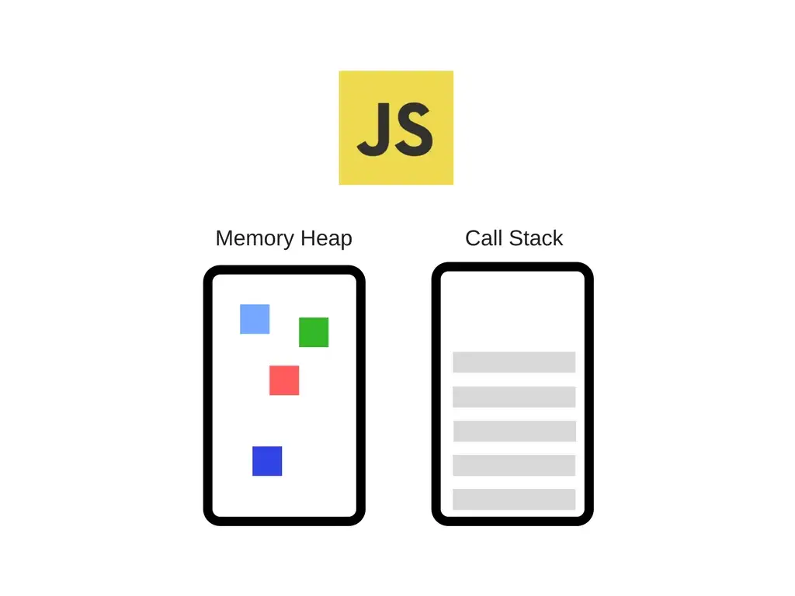
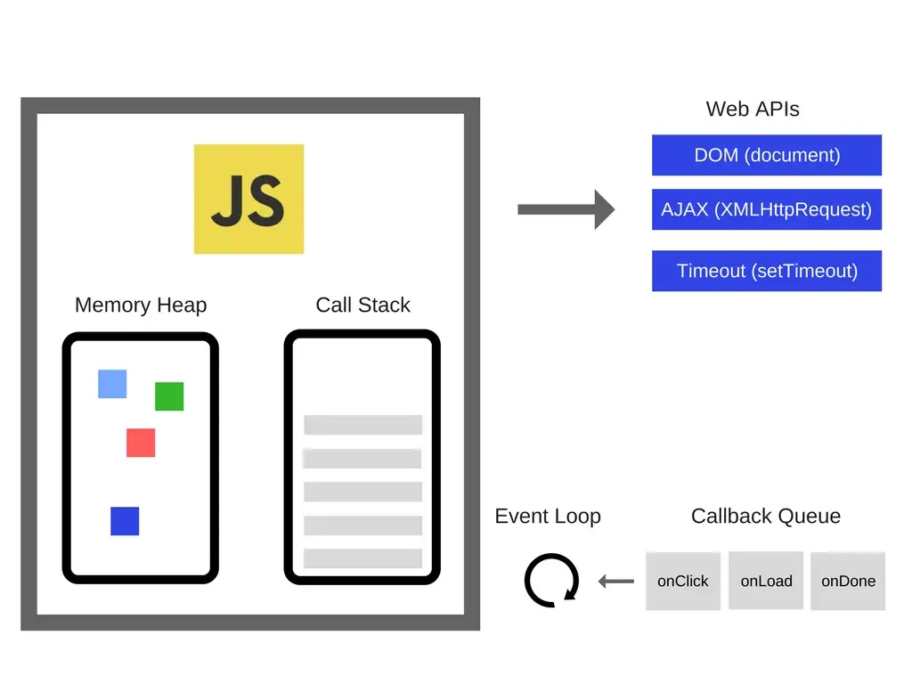
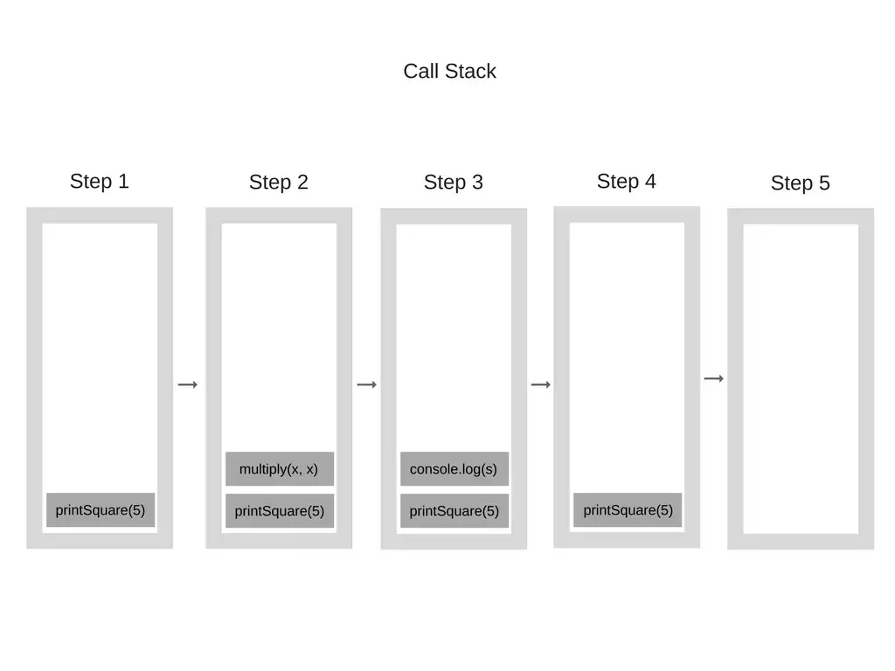
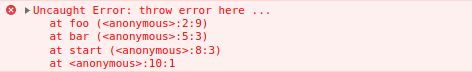
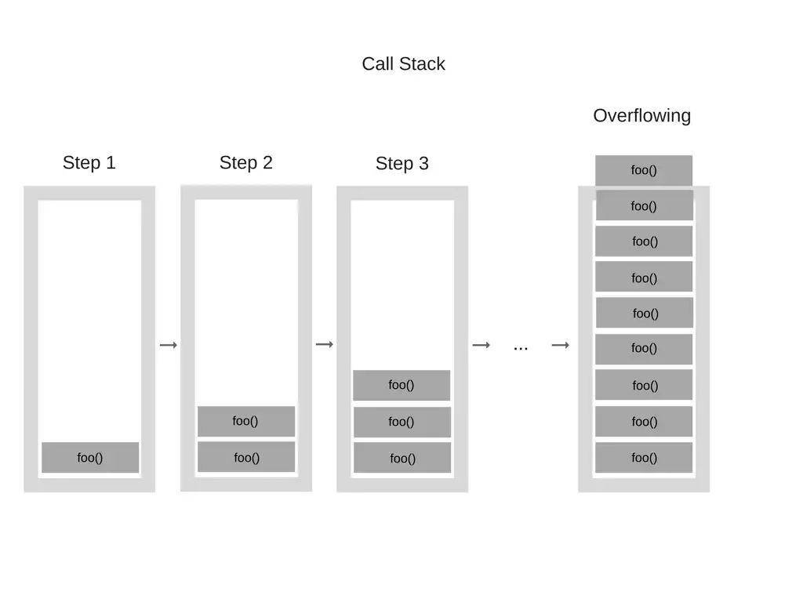

## JavaScript - Event Loop

O event loop é o mecanismo que permite a execução de código assíncrono no **Javascript**, sendo I/O não bloqueante. Sabemos que o JS é **single-threaded**, ou seja, executa uma coisa por vez, e precisa lidar com chamadas que demandam tempo em background para deixar a sua **Call Stack** livre para continuar executando o código.

Vamos caminhar pelos conceitos do event loop e entender o que acontece por deixa dos panos.

### A engine Javascript

Uma engine Javascript é um programa ou um interpretador que executa código Javascript. Uma engine Javascript pode ser implementada como um interpretador padrão, ou apenas um compilador que na hora certa (Just-in-time) compila Javascript para bytecode de alguma forma.

A engine mais famosa do javascript é a **V8** da Google que é a mesma utilizada pelo **NodeJs**, vamos começar por ela, abaixo uma representação simplificada.



A engine consiste de dois principais componentes:

**Memory Heap** — é onde a alocação de memória acontece.

**Call Stack** — onde seus stack frames (quadros de pilha) estão enquanto seu código é executado.

### O Runtime ( tempo de execução )

Há APIs no browser que têm sido utilizadas por quase todo o desenvolvedor Javascript (exemplo: **setTimeout** ). Estas APIs, no entanto, não são fornecidas pela Engine.

Então, de onde elas vem?

Acontece que a realidade é um pouco mais complicada.



Então, temos a engine, mas na verdade tem muito mais. Temos essas coisas das quais chamamos Web APIs que são fornecidas pelos browsers, como o **DOM**, **AJAX**, **setTimeout** e muito mais.

E então, temos o tão popular **event loop** e o **callback queue**.

### A Call Stack (Pilha de chamadas)

A **Call Stack** é uma estrutura de dados que armazena basicamente onde no programa nós estamos. Se entrarmos em uma função, nós colocamos ela sobre o topo da Stack. Se retornamos de uma função, saímos do topo da stack. Isso é tudo que a stack pode fazer.

Vamos ver um exemplo. Veja o seguinte código:

```js
function multiply(x, y) {
  return x * y;
}
function printSquare(x) {
  var s = multiply(x, x);
  console.log(s);
}
printSquare(5);
```

Quando a engine começa a executar esse código, a Call Stack vai estar vazia. Depois, os passos serão os seguintes:



> Cada entrada na Call Stack é chamada de **Stack frame**.

E isso é exatamente como stack traces estão sendo construídos quando uma exceção é lançada — isso é basicamente o estado da Call Stack quando a exceção acontece. Dê uma olhada no seguinte código:

```js
function foo() {
  throw new Error('throw error here ...');
}
function bar() {
  foo();
}
function start() {
  bar();
}
start();
```

Se isso é executado no Chrome, o seguinte stack trace vai ser produzido:



**"Explodir a stack”** — isso acontece quando você chega no tamanho máximo da Call Stack. E o que poderia acontecer muito facilmente, especialmente se você está utilizando recursão sem testar seu código muito extensivamente. Dê uma olhada neste exemplo de código:

```js
function foo() {
  foo();
}
foo();
```

Quando a engine começa a executar esse código, ela começa chamando a função “foo”. Essa função, no entanto, é recursiva e começa a chamar ela mesmo sem qualquer condição para terminar. Então em cada ponto da execução, a mesma função é adicionada para a Call Stack de novo e de novo. Isso parece alguma assim:



> Em algum ponto, no entanto, o número de chamadas de função na Call Stack excede o tamanho atual da Call Stack, e o browser decide tomar uma ação, lançando um erro.

Executando código sobre um single-thread pode ser muito fácil desde que você não tenha que lidar com cenários complicados que são criados em ambientes multi-threaded — por exemplo, deadlocks.

Mas executando sobre single-thread é muito limitante também. Já que o Javascript tem uma única Call Stack, o que acontece quando as coisas estão lentas ?

### Concorrência e o Event Loop

O que acontece quando você tem callback na Call Stack que tomam uma enorme quantidade de tempo a fim de ser processada? Por exemplo, imagine que você quer fazer alguma transformação complexa de imagem com Javascript no browser.

Você pode perguntar — Por que isso é um problema ? O problema é que enquanto a Call Stack tem funções para executar, o browser não pode fazer qualquer coisa mais — ele está bloqueado. Isso significa que o browser não pode renderizar, ele não pode executar qualquer outro código, está preso. E isso cria problemas se você quer UI fluídas em seu código.

E esse não é o único problema. Uma vez que o browser começa processar muitas tarefas na Call Stack, ele pode parar de responder por um longo tempo. E a maioria dos browsers tomam uma ação criando um erro, perguntando se você quer encerrar a página web.

![../images/error-browser.webp)

Agora, essa não é a melhor experiência do usuário não é?

Então, como podemos executar códigos pesados ​​sem bloquear a interface do usuário e deixar o navegador sem resposta? Bem, a solução é **callbacks assíncronos**.

### O Event Loop

A engine JS não é executada isoladamente, ela é executada dentro de um ambiente de _hospedagem_ , que para a maioria dos desenvolvedores é o típico **navegador da Web** ou o **Node.js**. Atualmente, o JavaScript é incorporado em todos os tipos de dispositivos, desde robôs até lâmpadas. Cada dispositivo representa um tipo diferente de ambiente de hospedagem para a engine JS.

O denominador comum em todos os ambientes é um mecanismo interno chamado **event loop**, que lida com a execução de vários fragmentos de seu programa ao longo do tempo, sempre chamando o engine de JS.

Isso significa que a engine JS é apenas um ambiente de execução sob demanda para qualquer código JS arbitrário. É o ambiente circundante que agenda os eventos (as execuções do código JS).

O navegador é então configurado para escutar a resposta da rede, e quando tiver algo para retornar a você, ele agendará a função de retorno de chamada ( callback ) a ser executada inserindo-a no _loop de eventos_ .

Vamos ver o diagrama abaixo:

![../images/event-loop-1.webp)

E quais são essas APIs da Web? Em essência, eles são tópicos que você não pode acessar, você pode apenas fazer chamadas para eles. Eles são as partes do navegador nas quais a simultaneidade entra em ação. Se você é um desenvolvedor do Node.js, essas são as APIs do C++.

Então, o que é o event loop depois de tudo ?

![../images/event-loop-2.webp)

O Event Loop tem um trabalho simples — para monitorar a call stack e a callback queue. Se a call stack estiver vazia, ela pegará o primeiro evento da fila e a empurrará para a call stack, que efetivamente a executa.

> Tal iteração é chamada de **tick** no Event Loop. Cada evento é apenas uma função de callback.

Vamos “executar” esse código a seguir e ver o que acontece:

```js
console.log('Hi');

setTimeout(function cb1() {
  console.log('cb1');
}, 5000);

console.log('Bye');
```

![../images/event-loop-gif.gif)

1. O estado é claro. O console do navegador é claro e a call stack está vazia.
2. `console.log('Hi')` é adicionado à call stack.
3. `console.log('Hi')` é executado.
4. `console.log('Hi')` é removido da pilha de chamadas.
5. `setTimeout(function cb1() { ... }) `é adicionado à call stack.
6. `setTimeout(function cb1() { ... }) ` é executado. O navegador cria um cronometro como parte das APIs da Web. Ele vai lidar com a contagem regressiva para você.
7. `setTimeout(function cb1() { ... }) `está completo e é removido da call stack.
8. `console.log('Bye')` é adicionado à call stack.
9. `console.log('Bye')` é executado.
10. `console.log('Bye')` é removido da call stack.
11. Após pelo menos 5000 ms, o temporizador é concluído e ele envia o retorno de chamada `cb1` para a fila de retorno de chamada.
12. O Event Loop retira o `cb1` da callback queue e o envia para a call stack.
13. O `cb1` é executado e adiciona o `console.log('cb1') `à call stack.
14. `console.log('cb1')` é executado.
15. O `console.log('cb1')` é removido da call stack.
16. O `cb1` é removido da call stack.

O **ES6** especifica como o _event loop_ deve funcionar, o que significa que, tecnicamente, ele está dentro do escopo das responsabilidades da engine JS, que não está mais desempenhando apenas uma função de ambiente de hospedagem.

### Job Queue

No event loop existe uma fila que lida com micro task chamada **Job Queue** que trata caso de assíncronismo como **Promise** , enquanto as macro task é tratado pela **Task Queue**.

Aqui estão alguns pontos essenciais a serem observados:

- Nem todas as tarefas são criadas com a mesma prioridade. Existem macrotarefas e microtarefas.
- MacroTasks são chamados `Tasks` e MicroTasks são chamados `Jobs`.
- Exemplos de macrotarefas são **setTimeout**, **setInterval**, **setImmediate**, **I/O tasks**, etc.
- Exemplos de microtarefas são **Promises**, **process.nextTick**, etc.
- A Fila no Loop de Eventos contém as **Tasks** ( ou as MacroTasks ) chamadas **Task Queue**.
- A fila no loop de eventos contém os **Jobs** ( ou as microtasks ) chamados **Job Queue**.
- Por exemplo, **Promises** estão em **Job Queue** e as funções para **setTimeOut** estão em **Task Queue**.

> A **Job Queue** possui prioridade sobre a **Task Queue** no **Event Loop**.

No geral, o Event Loop ganhou mais um item a ser considerado em sua orquestração de Execução de Código. Vamos entender a lógica acima com um fluxo de execução de código.

```js
const tom = () => console.log('Tom');

const jerry = () => console.log('Jerry');

const cartoon = () => {
  console.log('Cartoon');

  setTimeout(tom, 5000);

  new Promise((resolve, reject) => resolve('should it be right after Tom, before Jerry?')).then(
    resolve => console.log(resolve),
  );

  jerry();
};

cartoon();
```

Portanto, a saída esperada é,

```
Cartoon
Jerry
should it be right after Tom, before Jerry?
Tom
```

Fluxo de execução:

- A função `cartoon` entra na call stack.
- Ele executa o log do console do texto Cartoon. A `setTimeOut` API da Web sai da call stack na linha de execução a seguir e a função associada `tom` é colocada em **TaskQueue**.
- Na seguinte linha de execução, encontramos uma **Promise**. Um callback de uma promise obtém um lugar na **JobQueue**. Portanto, a execução da função de log do console na promessa vai para **JobQueue**.
- Na linha de execução a seguir, a função `jerry` é colocada na stack e executada.
- Temos uma entrada em **TaskQueue** e outra em **JobQueue**. O event loop prioriza todos os **Jobs** em _JobQueue_ sobre qualquer coisa em _TaskQueue_. Portanto, o _callback_ da _Promise_ chega primeiro à call stack, é executado e, em seguida, a função `tom` chega à call stack da _TaskQueue_ e é executada.

E por aqui terminamos mais esse estudo de conceitos relacionado ao Javascript. Entender como funciona o **Event Loop** nos ajuda a criar códigos melhores, mais otimizados e é um conhecimento muito importante para quem quer se torna um programador acima da média.

- Links de **referências** e **saiba mais**.
- - [Como o Javascript funciona: O event loop](https://medium.com/@robisson/como-o-javascript-funciona-o-event-loop-e-o-surgimento-da-programa%C3%A7%C3%A3o-ass%C3%ADncrona-5-maneiras-de-18d0b8d6849a)
- - [Task Queue and Job Queue - Deep dive into Javascript Event Loop Model](https://blog.greenroots.info/task-queue-and-job-queue-deep-dive-into-javascript-event-loop-model)

- - [Javascript Event Loop - Why so Serious!](https://blog.greenroots.info/javascript-event-loop-why-so-serious#cjugsvvfa004mmts1hi8rfyf4)
- - [NodeJS para iniciantes - Event Loop](https://nodejs.reativa.dev/0029-node-event-loop/index)

_Para se aprofundar mais no funcionamento interno do **V8** e algoritmos de gerenciamento de memória acesse essa serie de artigos_.

- [Como o Javascript funciona: uma visão geral da engine, runtime e da call stack](https://medium.com/reactbrasil/como-o-javascript-funciona-uma-vis%C3%A3o-geral-da-engine-runtime-e-da-call-stack-471dd5e1aa30)

> <sub> _Este post tem como objetivo ajudar quem esta começando no aprendizado das tecnologias web, além de servir como incentivo no meus estudos e a criar outros posts pra fixação do aprendizado._ </sub>

<p align="center"> Me paga um café ? :) | pix: <em>nascimento.dev.io@gmail.com</em> </p>

<h4> <em> Me Sigam :) </em> </h4>

[Linkedin](https://www.linkedin.com/in/nascimento-dev-io/) |
[Github](https://github.com/nascimento-dev-io)
