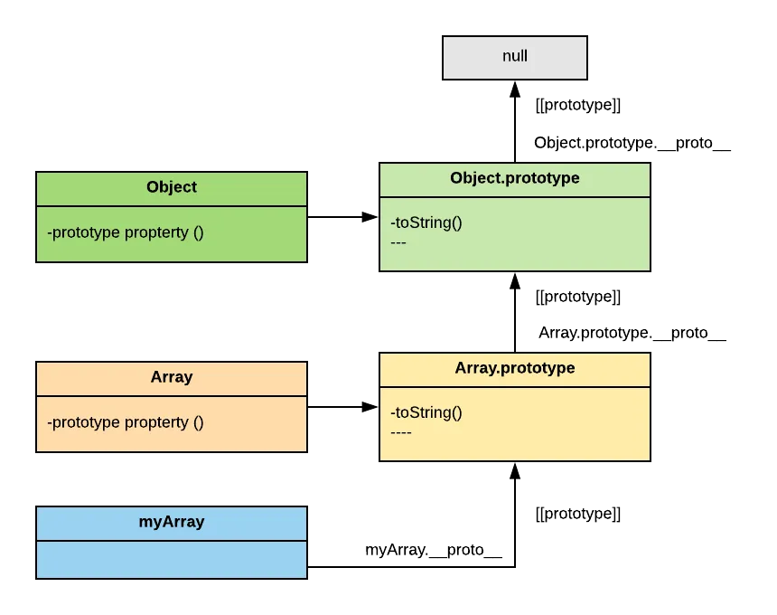

## Javascript - Herança - Prototype Chain

Em javascript tudo é **objeto**, e a herança se dá através de `prototype chain`, a keyword **class** é um _sintax sugar_ da linguagem para funções construtoras que são as responsáveis por criar objetos através do operador **new**.

Cada função possui uma propriedade chamada **prototype** que faz referência ao seu prototipo ( métodos e propriedades ).



> Apenas funções possuem a propriedade **prototype** e so as funções construtoras a utiliza.
>
> A propriedade **proto** recebe a referência do objeto herdado, fazendo assim uma cadeia de protótipos.

_Vamos entender melhor com exemplos._

```js
const number = 256.0;
console.log(Object.getPrototypeOf(number)); // => Number {}
console.log(number.__proto__ === Number.prototype); // => true
number.toFixed(2); // => 256.00
```

Quando criamos uma variável do tipo **primitivo** ainda assim temos acesso a métodos e propriedades, e isso é possível porque o **JS** 'encapsula' esse tipo em um objeto correlacionado. ( Number, String, Boolean ).

O JavaScript possui um grande quantidade de [objetos globais](https://developer.mozilla.org/pt-BR/docs/Web/JavaScript/Reference/Global_Objects) sendo os mais comuns **Array**, **Date**, **Function**, **Object**.

A cadeia de protótipo termina quando a busca encontra o último objeto da cadeia que é o **Object** que possui a propriedade \_\_proto\_\_ recebendo **null**.

> Todos os objetos são herdados do **Object**, também é possível criar um objeto definindo seu prototype como **null**.

<p align='center'> Prototype chain - Diagrama simples</p>

![]./_images/prototype-chain.png)

Quando chamamos um método ou propriedade que o objeto atual não possui, a engine js busca no nível superior da cadeia de protótipo até o último elo ( **Object** ), caso não seja encontrado **undefined** é retornado.

_Vamos criar nossos objetos e protótipos._

```js
const personPrototype = {
  getName() {
    return this.name;
  },
};

function Person(name, age) {
  this.name = name;
  this.age = age;
}

Person.prototype = personPrototype;

const person = new Person('Jorge', 33);
console.log(person); // => { name: 'Jorge', age: 33
console.log(person.getName()); // =>  'Jorge'
```

- Podemos criar métodos ou propriedade inserindo-os diretamente a propriedade **prototype**.

```js
// [código omitido]...

Person.prototype.getAge = function () {
  return this.age;
};

console.log(person.getAge()); // =>  33
console.log(person.__proto__); // =>  { getName: [Function: getName], getAge: [Function (anonymous)] }
```

- Podemos criar métodos que pertencem apenas a função construtora e não ao objetos instanciado semelhante a um método privado. ( ex. **Array.from()** )

```js
// [código omitido]...
Person.greeting = function (name) {
  return `hello ${name}`;
};

const person = new Person('Jorge', 33);
console.log(Person.greeting(person.name)); // => hello Jorge
```

- Podemos utilizar o método **Object.create(prototipo)** para criar um objeto setando seu protótipo ou passando **null** ao parâmetro, sendo assim esse não possui o elo com o **Object**.

- Podemos checar quais propriedade é do objeto atual ou de seus protótipos com o método **hasOwnProperty()** que é um método herdado de **Object.prototype**.

```js
// [código omitido]...

Person.prototype.propInherited = true;

const person = new Person('Jorge', 33);

for (let prop in person) {
  console.log(prop, `has my own property?`, person.hasOwnProperty(prop));
}

/*
  name has my own property? true
 age has my own property? true
 getName has my own property? false
 getAge has my own property? false
 propInherited has my own property? false
*/
```

### Performance

O tempo de pesquisa para as propriedades que estão no alto da cadeia de protótipos pode ter um impacto negativo no **desempenho**, e isso pode ser significativo no código em que o desempenho é crítico. Além disso, tentar acessar propriedades inexistentes irá sempre atravessar a cadeia cheia do protótipo (full prototype chain).

> Nunca estenda protótipos nativos a menos que seja para conseguir compatibilidade com novas "features" do JavaScript.

Esta técnica é chamada de "monkey patching" e quebra o encapsulamento. Não existe uma boa razão para desorganizar tipos nativos do JavaScript para adicionar uma nova funcionalidade ao mesmo.

- [MDN - Herança e cadeia de protótipos (prototype chain)](https://developer.mozilla.org/pt-BR/docs/Web/JavaScript/Inheritance_and_the_prototype_chain)
- [JavaScript Prototype and Prototype Chain explained.](https://blog.bigoodyssey.com/javascript-prototype-and-prototype-chain-explained-fdc2ec17dd04)
